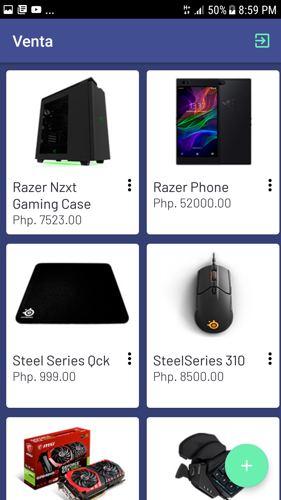
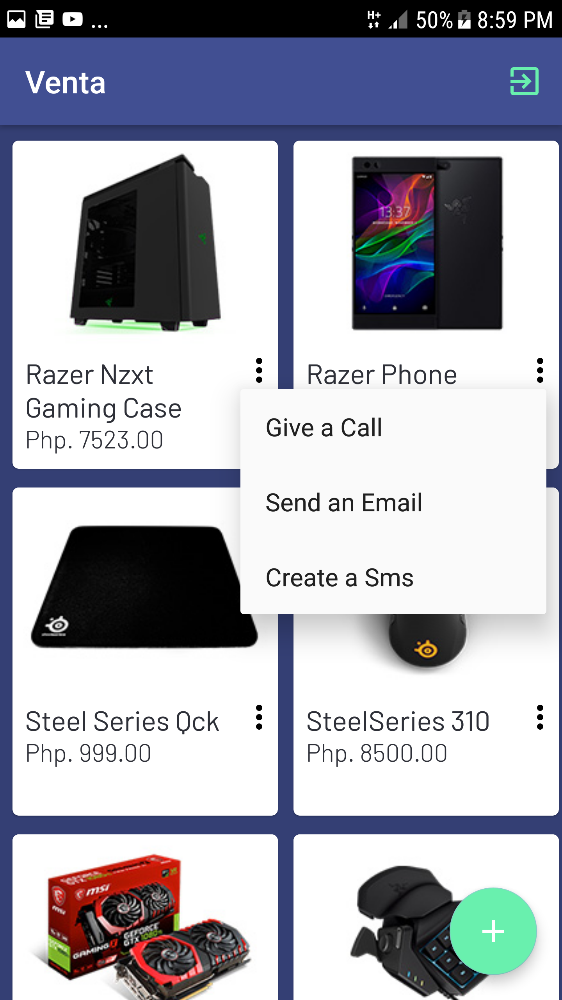
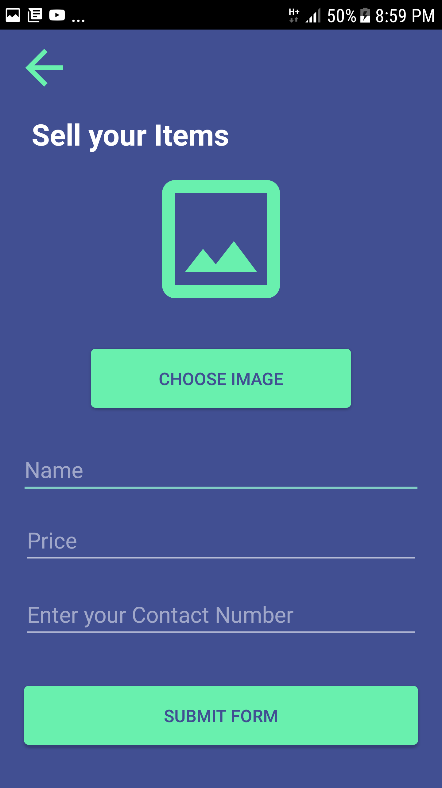
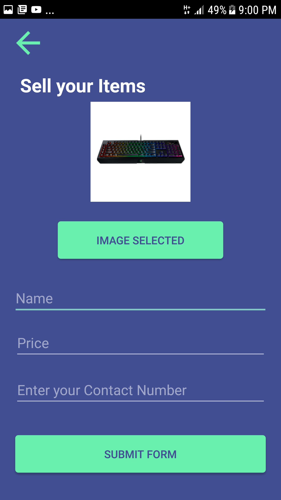

# Venta-Android
Android Application For selling items.
Firebase Auth,Storage,Database is used.
Glide is also used.

## Screenshots
 
 

## Information
for more detailed explanation of how things work, You can contact me via Gmail
